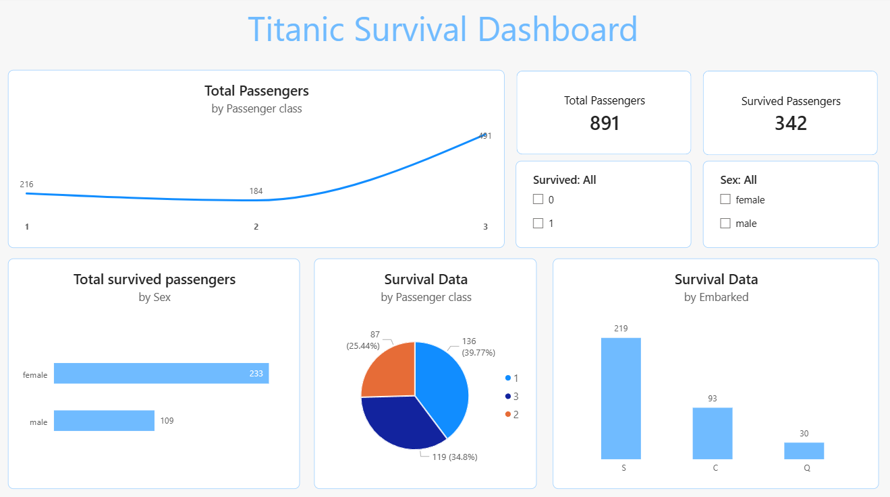

<div align="center">

# 🚢 Titanic Survival Dashboard

### *An Interactive Power BI Dashboard Uncovering the Stories Behind the Titanic Disaster*

[](https://powerbi.microsoft.com/)
[](https://www.kaggle.com/datasets/yasserh/titanic-dataset)
[]()

<br/>

> *"On April 15, 1912, the Titanic sank. Of the 891 passengers aboard, only 342 survived. This dashboard reveals who they were — and why they made it."*

<br/>



</div>

---

## 📌 Table of Contents

- [📖 Project Overview](#-project-overview)
- [✨ Key Insights](#-key-insights)
- [📊 Dashboard Features](#-dashboard-features)
- [🗂️ Dataset Details](#️-dataset-details)
- [🛠️ Tools & Technologies](#️-tools--technologies)
- [🚀 Getting Started](#-getting-started)
- [📁 File Structure](#-file-structure)
- [🤝 Connect With Me](#-connect-with-me)

---

## 📖 Project Overview

This **interactive Power BI dashboard** provides a compelling visual narrative of the Titanic disaster — analyzing survival patterns across passenger class, gender, and port of embarkation. Built to demonstrate end-to-end **data analysis and business intelligence** skills, this project transforms raw historical data into actionable visual stories.

Whether you're a data enthusiast, a history buff, or a recruiter evaluating BI skills — this dashboard has something meaningful to show you. 💡

---

## ✨ Key Insights

| 🔍 Insight | 📈 Finding |
|:--|:--|
| 👥 **Total Passengers** | 891 passengers aboard |
| 🟢 **Survivors** | 342 passengers survived (~38.4%) |
| 👩 **Gender Gap** | Females had significantly higher survival rates than males (577 male vs 314 female passengers) |
| 🎩 **Class Divide** | 1st class passengers had the highest survival rate at ~39.77% |
| ⚓ **Embarkation Impact** | Southampton (S) had the most passengers at 219, followed by Cherbourg (C) at 93 and Queenstown (Q) at 30 |
| 🚢 **3rd Class Majority** | Class 3 was the most populated with 491 passengers |

---

## 📊 Dashboard Features

### 🖼️ Visual Components

```
📉 Line Chart       →  Total Passengers by Passenger Class
📊 Bar Chart        →  Count of Survived by Sex
🍩 Pie Chart        →  Survival Data by Passenger Class
📊 Bar Chart        →  Survival Data by Embarkation Port
🔢 KPI Cards        →  Total Passengers | Survived Passengers
🎛️ Slicers          →  Filter by Survived (0/1) | Filter by Sex
```

### 🎯 Interactivity
- **Dynamic Slicers** — Filter the entire dashboard by survival status or gender with a single click
- **Cross-filtering** — Visuals respond to each other for deep-dive analysis
- **Tooltips** — Hover over data points for detailed breakdowns
- **Responsive Layout** — Clean, professional card-based design

---

## 🗂️ Dataset Details

📦 **Source:** [Titanic Dataset — Kaggle](https://www.kaggle.com/datasets/yasserh/titanic-dataset)

| Column | Description |
|:--|:--|
| `PassengerId` | Unique ID for each passenger |
| `Survived` | Survival flag (0 = No, 1 = Yes) |
| `Pclass` | Passenger class (1 = 1st, 2 = 2nd, 3 = 3rd) |
| `Name` | Full name of passenger |
| `Sex` | Gender of passenger |
| `Age` | Age in years |
| `SibSp` | Number of siblings/spouses aboard |
| `Parch` | Number of parents/children aboard |
| `Ticket` | Ticket number |
| `Fare` | Passenger fare |
| `Cabin` | Cabin number |
| `Embarked` | Port of embarkation (C = Cherbourg, Q = Queenstown, S = Southampton) |

**Total Records:** 891 rows | **Columns:** 12

---

## 🛠️ Tools & Technologies

<div align="center">

| Tool | Purpose |
|:--|:--|
|  | Dashboard creation & data visualization |
|  | Raw data source |
|  | Data Analysis Expressions for measures |
|  | Data transformation & cleaning |

</div>

---

## 🚀 Getting Started

### Prerequisites
- [Microsoft Power BI Desktop](https://powerbi.microsoft.com/desktop/) (Free) installed on your machine

### Steps to Run

```bash
# 1. Clone the repository
git clone https://github.com/HarshalVora86/Titanic_Survival_dashboard.git

# 2. Navigate to the project folder
cd Titanic_Survival_dashboard

# 3. Open the Power BI file
open Titanic_Survival.pbix   # or double-click the .pbix file
```

> 💡 **Tip:** If the data source path breaks, go to `Home → Transform Data → Data Source Settings` and update the path to `titanic_dataset.csv` on your local machine.

---

## 📁 File Structure

```
📦 Titanic_Survival_dashboard
 ┣ 📊 Titanic_Survival.pbix       ← Power BI Dashboard file
 ┣ 📄 titanic_dataset.csv         ← Raw dataset
 ┣ 🖼️ Screenshot_Dashboard.png    ← Dashboard preview image
 ┗ 📝 README.md                   ← You are here!
```

---

## 🤝 Connect With Me

<div align="center">

If you found this project interesting, I'd love to connect! 😊

[](https://www.linkedin.com/in/harshalvora)
[](https://github.com/HarshalVora86)

</div>

---

<div align="center">

### ⭐ If you like this project, give it a star!

*Made with ❤️ and Power BI*

</div>
